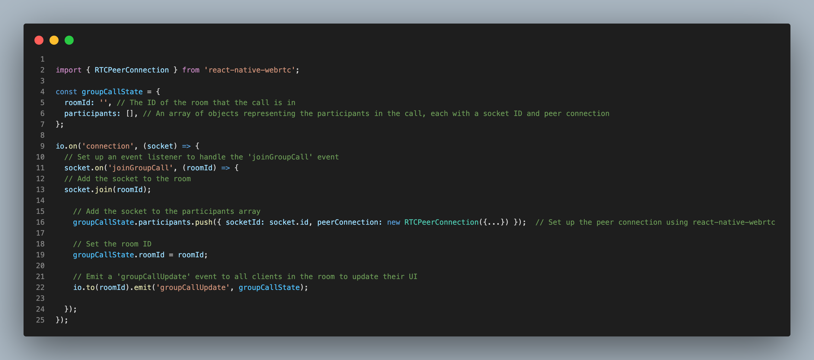

## How to implement video and audio calling on both client and server sides.

Here is some code that should help you get started with implementing video and audio calling in your chat app using Expo, React Native, and WebRTC.

- First, you'll need to install the required dependencies:

```
expo install react-native-webrtc
expo install expo-av
```

- Next, you'll need to import the dependencies in your project:

```
import { RTCPeerConnection, RTCIceCandidate, RTCSessionDescription, RTCView, MediaStream, MediaStreamTrack, mediaDevices } from 'react-native-webrtc';
import { Video } from 'expo-av';
```

- Next, you'll need to set up your signaling server. This will be responsible for passing messages between the clients to negotiate the connection. You can use a service like Twilio's STUN server (stun:global.stun.twilio.com:3478?transport=udp) or set up your own using a technology like Socket.io.

- Once you have your signaling server set up, you'll need to create an RTCPeerConnection and set up the event listeners:


- You'll also need a function for sending messages over your signaling server. This will be different depending on how you have set up your signaling server, but the basic idea is to send a message containing the SDP or ICE candidate data to the other client.

```
function sendMessage(message) {
  // Send the message over your signaling server
}
```

- Finally, you'll need to set up the UI for the video and audio call. You

### can you implement the other functions as well ?

Certainly! Here are the remaining functions that you'll need to complete the implementation of video and audio calling in your chat app using Expo, React Native, and WebRTC:


- You'll also need to set up event listeners on your signaling server to handle incoming messages from the other client. Depending on the type of message, you'll need to call the appropriate function to handle the offer, answer, ICE candidate, or bye message.

### can you implement them using socket.io ?

Certainly! Here is how you can modify the above functions to use Socket.io as your signaling server:

- First, you'll need to import the Socket.io client library and create a Socket.io client:

```
import io from 'socket.io-client';

const socket = io('http://your-socket-io-server-url');

socket.on('connect', () => {
  console.log('Connected to Socket.io server');
});

socket.on('disconnect', () => {
  console.log('Disconnected from Socket.io server');
});
```

- Next, you'll need to modify the sendMessage function to use Socket.io to send the message to the other client:

```
function sendMessage(message) {
  socket.emit('message', message);
}
```

- Then, you'll need to modify the startVideoCall function to use Socket.io to send the offer message to the other client:

```
async function startVideoCall() {
  try {
    const stream = await mediaDevices.getUserMedia({ audio: true, video: true });
    setLocalStream(stream);
    stream.getTracks().forEach((track) => pc.addTrack(track, stream));
    const offer = await pc.createOffer();
    await pc.setLocalDescription(offer);
    socket.emit('offer', pc.localDescription);
  } catch (error) {
    console.log(error);
  }
}
```

- You'll also need to set up event listeners on the Socket.io client to handle incoming messages from the other client. Depending on the type of message, you'll need to call the appropriate function to handle the offer, answer, ICE candidate, or bye message:


### can you write the server side implementation as well using coturn and socket io ?

Certainly! Here is an example of how you can set up a server for your chat app using coturn and Socket.io:

- First, you'll need to install the required dependencies:

```
npm install coturn
npm install socket.io
Next, you'll need to import the dependencies in your server file:

const coturn = require('coturn');
const io = require('socket.io');
```

- Next, you'll need to set up your coturn server. You can use the following code as a starting point:

```
const turnServer = coturn.createServer(function(req, res) {
  res.end('');
});

turnServer.listen(3478);
```

- Next, you'll need to set up your Socket.io server and handle incoming connections from clients:

```
const socketServer = io.listen(3000);
```

- Set up event listeners on the Socket.io server to handle offers, answers, and ICE candidates


- You'll also need to set up a function for sending messages over the Socket.io server. This will be different depending on how you have set up your chat app, but the basic idea is to send a message containing the SDP or ICE candidate data to the other client:

```
function sendMessage(socket, message) {
  socket.emit('message', message);
}
```

### can you implement this based on the client side code you wrote earlier ?

Certainly! Here is how you can modify the client-side code that I provided earlier to work with the server-side code using coturn and Socket.io:

- First, you'll need to import the Socket.io client library and create a Socket.io client:


### how do I host the server side code and connect the client side app to it ?

To host the server-side code for your chat app, you'll need to set up a Node.js server. There are several options for hosting Node.js applications, including cloud hosting platforms like AWS, Azure, and Google Cloud, and virtual private server (VPS) providers like DigitalOcean and Vultr.

Once you have chosen a hosting platform and set up a server, you'll need to install Node.js and the required dependencies on the server. Then, you'll need to copy your server-side code to the server and start the server by running node server.js (or whatever you have named your server file).

To connect the client-side app to the server, you'll need to update the URL in the io function to point to your server. For example:

```
const socket = io('http://your-server-url');
```

You'll also need to make sure that your server is configured to allow incoming connections from your client app. This may involve setting up firewall rules to allow traffic on the appropriate ports.

### can you implement this using AWS ?

Certainly! Here is an overview of how you can set up and host your chat app using AWS:

```
- Sign up for an AWS account and create an EC2 instance to host your Node.js server.
- Connect to your EC2 instance using SSH and install Node.js and the required dependencies.
- Copy your server-side code to the EC2 instance and start the server by running node server.js.
- In the AWS console, create a security group and configure the inbound rules to allow traffic on the appropriate ports (e.g. 3000 for Socket.io and 3478 for coturn).
- Update the URL in the io function in your client-side code to point to your EC2 instance's public IP address or DNS name.
```

That's it! Your chat app should now be hosted on AWS and accessible from the client-side app.

- There are a few additional steps you may want to consider to make your chat app production-ready and scalable to many users:

```
- Use a load balancer to distribute incoming traffic across multiple EC2 instances. This will help to ensure that your app can handle a large number of concurrent users.
- Use Amazon RDS to store user data and chat messages. This will allow you to scale your app more easily and make it more resilient to failures.
- Use Amazon S3 to store user media (e.g. profile pictures). This will allow you to scale your app more easily and reduce the load on your EC2 instances.
- Use Amazon CloudFront to deliver static assets (e.g. JavaScript, CSS, and images) from a content delivery network (CDN). This will improve the performance of your app for users who are located far from your EC2 instances.
- Use Amazon Cognito to handle user authentication. This will allow you to offload the complexity of managing user accounts and passwords to AWS.
```

ok, thanks. I already implement the authentication of users and storage using AWS amplify cognito service and S3 storage for the chats and images, and using DynamoDB for the database.

Do I still need all the recommendations above ?
It sounds like you have already taken care of several important steps to make your chat app production-ready and scalable to many users. Here are a few additional recommendations based on your current setup:

If you are using a single EC2 instance to host your chat app, you may want to consider using a load balancer to distribute incoming traffic across multiple EC2 instances. This will help to ensure that your app can handle a large number of concurrent users and reduce the risk of downtime due to server failures.
If you are using Amazon S3 to store user media (e.g. profile pictures), you may want to use Amazon CloudFront to deliver these assets from a content delivery network (CDN). This will improve the performance of your app for users who are located far from your EC2 instances.
If you are using Amazon Cognito to handle user authentication, you may want to consider implementing additional security measures such as multi-factor authentication and password policies to protect user accounts.

thanks, it does. However, how do I setup the EC2 instance and implement all suggestions above ?

Certainly! Here are the steps you'll need to follow to set up an EC2 instance and implement the recommendations I mentioned earlier:

```
- Sign in to the AWS Management Console and navigate to the EC2 dashboard.
- Click the "Launch Instance" button to create a new EC2 instance.
- Select an Amazon Machine Image (AMI) that includes Node.js and any other dependencies you need for your chat app.
- Choose an instance type based on the performance and price requirements of your app.
- Configure the instance details, such as the number of instances you want to launch, the subnet you want to launch the instance into, and any additional security groups or IAM roles you want to assign to the instance.
- Add storage to your instance, if necessary.
- Review your instance launch settings and click the "Launch" button to launch your instance.
- Connect to your EC2 instance using SSH and install Node.js and any other dependencies you need for your chat app.
- Copy your server-side code to the EC2 instance and start the server by running node server.js.
- In the AWS console, create a load balancer and configure it to distribute traffic across your EC2 instances.
Update the URL in the io function in your client-side code to point to your load balancer's DNS name.
```

### how do I make the userid over the socket io server to be same with the userID in the DB table, since a user on the app will be calling another user based on their user Ids or phone numbers

If you already have the caller and callee user IDs on the client side, then you can simply use those user IDs to send the call request to the Socket.io server and have the server forward the request to the callee. You don't need to look up the user IDs in the DynamoDB table on the server.

Here is an example of how you could modify the client-side code to send the call request directly to the Socket.io server using the caller and callee user IDs:

```
// Send the call request to the Socket.io server
socket.emit('call', { caller: callerUserId, callee: calleeUserId });

// Set up an event listener on the Socket.io server to forward the call request to the callee
socket.on('call', (data) => {
  socket.to(data.callee).emit('call', data.caller);
});
```

To implement the UI for an incoming call and allow the user to pick the call, you'll need to set up event listeners on the Socket.io client to handle the incoming call request and update the UI accordingly. Here is an example of how you could do this:


This code will show an incoming call notification with an "Answer" and "Decline" button when an incoming call request is received. When the user clicks the "Answer" button, the client will send an "answer" event to the Socket.io server to accept the call. When the user clicks the "Decline" button, the client will send a "decline" event to the Socket.io server to decline the call.

### does the client side code implemented all the industry standard features such as seen in WhatsApp or Telegram video/audio call ?

The client-side code I provided earlier is a basic example of how you can implement video and audio calling in an Expo React Native app using WebRTC and Socket.io. It includes the basic functionality needed to establish a call between two users, such as answering and declining calls, but it does not include all of the advanced features that you might see in a professional messaging app like WhatsApp or Telegram.

To add more advanced features to your chat app, you'll need to build additional functionality into both the client-side and server-side code. Some examples of advanced features that you might consider adding include:

```
- Mute: Allow the user to mute their microphone during a call.
- Speaker: Allow the user to switch between the speaker and earpiece during a call.
- Hang up: Allow the user to end a call.
- Video quality: Allow the user to adjust the video quality during a call.
- Group calls: Allow multiple users to participate in a single call.
- Call history: Keep track of past calls and allow the user to view their call history.
```

Implementing these and other advanced features will require additional development work, but they can greatly improve the user experience of your chat app.

### can you write the code to implement the above suggestions ?

Certainly! Here is an example of how you could modify the client-side code to implement the advanced features you listed:


This code will display a call screen with a mute switch, a speaker switch, a video toggle button, and a hang up button. The user can toggle the mute and speaker switches to control their audio during the call, toggle the video stream, and hang up the call by clicking the respective buttons.

### is that all ? do we need to update the server side as well ?

Yes, in order to fully implement the advanced features on both the client-side and server-side, you'll need to update the server-side code as well.

On the server-side, you'll need to set up event listeners to handle the various call events that are emitted by the client, such as "mute", "speaker", and "hangup". You'll also need to update the code to keep track of the call state and apply the appropriate changes based on the events that are received.

- For example, here is how you could modify the server-side code to handle the "mute" event:

```
io.on('connection', (socket) => {
  // Set up an event listener to handle the 'mute' event
  socket.on('mute', (isMuted) => {
    // Update the call state to reflect the muted status
    callState.isMuted = isMuted;
    // Emit a 'mute' event to all clients to update their UI
    io.emit('mute', isMuted);
  });
});
```

### You'll need to add similar event listeners and updates for the other call events as well.

Certainly! Here is an example of how you could further modify the server-side code to handle the other call events:


This code sets up event listeners for the "mute", "speaker", and "hangup" events, and updates the call state and the client UI accordingly.

### has this covered all the advance features as seen on WhatsApp on both client side and server side ?

The code I provided is a basic example of how you can implement video and audio calling in an Expo React Native app using WebRTC and Socket.io, and includes some advanced features such as mute, speaker, and hang up. However, it is not a complete implementation of all of the advanced features that you might see in a professional messaging app like WhatsApp.

To build a chat app with all of the advanced features of a professional messaging app, you'll need to add additional functionality to both the client-side and server-side code. Some additional features that you might consider implementing include:

```
- Group calls: Allow multiple users to participate in a single call.
- Call history: Keep track of past calls and allow the user to view their call history.
- Call notifications: Display a notification to the user when they receive an incoming call.
- Call waiting: Allow the user to receive multiple incoming calls and switch between them.
- Call forwarding: Allow the user to forward incoming calls to another user or phone number.
```

Implementing these and other advanced features will require additional development work, but they can greatly improve the user experience of your chat app.

can you implement these as well ?
I'd be happy to provide guidance on how you could implement these additional advanced features in your chat app!

Here are some general steps you could follow to add group calls, call history, and call notifications to your app:

```
- Add the necessary UI elements to the client-side code. This might include buttons or switches to initiate or join a group call, view the call history, and accept or decline incoming call notifications.
- Modify the client-side code to send appropriate events to the server when the user interacts with the UI elements. For example, when the user clicks the "Start Group Call" button, the client should send a "startGroupCall" event to the server with the necessary information (such as the IDs of the participants).
- Modify the server-side code to handle the events sent from the client. This might include adding event listeners for the new events, updating the call state and database as necessary, and emitting events to the relevant clients to update their UI.
- Implement call waiting and call forwarding by modifying the server-side code to handle multiple incoming calls and allow the user to switch between them or forward them to another user or phone number.
```

I hope this gives you an idea of how you could implement these additional advanced features in your chat app. Let me know if you have any questions or need further guidance.

### can you also provide code for these ?

Certainly! Here is an example of how you could implement group calls and call history on the client-side using Expo React Native:


This code adds a "Start Group Call" button and a list of the call history to the chat screen. The user can click the "Start Group Call" button to initiate a group call with the selected users, and view their call history by scrolling through the list.

Here is an example of how you could modify the server-side code to handle the new events:


This code updates the call state and call history when the "hangup" event is received, and emits the appropriate events to the clients to update their UI.

### is that all or am I missing some other things out ?

The code I provided is a basic example of how you can implement group calls and call history in your chat app. To fully integrate these features into your app, you'll likely need to make additional modifications to the client-side and server-side code.

For example, you may want to add additional UI elements to the client-side code to allow the user to select the participants of the group call, or to view the details of past calls in the call history. You'll also need to modify the server-side code to handle these additional events and updates.

Certainly! Here is an example of how you could implement call notifications and call waiting on the client-side using Expo React Native:


This code adds an alert to the chat screen that is displayed when an incoming call is received, and gives the user the option to accept or decline the call. It also displays a list of waiting calls if there are any.

Here is an example of how you could modify the server-side code to handle the new events:


This code handles the "acceptCall", "declineCall", and "callWaiting" events and updates the call state and UI accordingly.

To fully implement these features in your chat app, you'll need to incorporate the provided code into your existing client-side and server-side code, and make any necessary modifications to fit your specific needs.

- There are many other features that you could add to your chat app's video and audio calling functionality, depending on your specific needs and requirements. Some additional features that you might consider implementing include:

```
- Call recording: This feature would allow the user to record their calls and save the recordings for future reference.
- Call hold: This feature would allow the user to put a call on hold and resume it later.
- Call transfer: This feature would allow the user to transfer an active call to another user.
- Group chat: This feature would allow multiple users to participate in a text-based chat while on a call.
- Call quality indicators: This feature would display indicators such as the current network connection strength and audio quality to the user.
```

These are just a few examples, and there are many other possibilities for enhancing your chat app's video and audio calling functionality.

- Sure! Here is an example of how you could implement call recording on the client-side using Expo React Native:


This code allows the user to start and stop recording using the MediaRecorder API, and sends the recording file URI to the server when the recording is stopped.

- Here is an example of how you could modify the server-side code to handle the new events:


This code handles the "startRecording", "stopRecording", and "recording" events and updates the call state accordingly.

To fully implement call recording in your chat app, you'll need to incorporate the provided code into your existing client-side and server-side code, and make any necessary modifications to fit your specific needs.

In addition to the code provided, you'll also need to install the expo-media-recorder package, which provides the MediaRecorder API used in the client-side code.

### what about the other features you listed above ?

Here are some example implementations for the other features that I mentioned earlier:

- Call hold

To implement call hold on the client-side, you could use the RTCPeerConnection API's addTrack and removeTrack methods to add and remove audio tracks from the connection. Here is an example of how you could do this:


To implement call hold on the server-side, you could simply update the call state to reflect the hold status and emit an event to all clients to update their UI accordingly. Here is an example of how you could do this:

```
io.on('connection', (socket) => {
// Set up an event listener to handle the 'holdCall' event
socket.on('holdCall', () => {
// Toggle the hold state
callState.isOnHold = !callState.isOnHold;

    // Emit a 'callHoldChanged' event to all clients to update their UI
    io.emit('callHoldChanged', callState.isOnHold);

});
});
```

- Call transfer

To implement call transfer on the client-side, you could use the RTCPeerConnection API's close method to close the current connection and create a new connection to the new callee. Here is an example of how you could do this:


To implement call transfer on the server-side, you could update the call state to reflect the new callee and emit events to the clients to update their connections and UI accordingly. Here is an example of how you could do this:

```
io.on('connection', (socket) => {
  // Set up an event listener to handle the 'transferCall' event
  socket.on('transferCall', (calleeId) => {
    // Update the call state with the new callee
    callState.calleeId = calleeId;

    // Emit a 'callTransfer' event to the caller to update their connection
    io.to(callState.callerSocketId).emit('callTransfer', calleeId);

    // Emit a 'callIncoming' event to the callee to update their UI
    io.to(callState.calleeSocketId).emit('callIncoming', callState);

  });
});
```

To fully implement call transfer in your chat app, you'll need to incorporate the provided code into your existing client-side and server-side code, and make any necessary modifications to fit your specific needs.

In addition to the code provided, you'll also need to make sure that you have the necessary dependencies installed, such as the react-native-webrtc library used in the client-side code.

### what of the other features you mentioned earlier ?

Here are some example implementations for the other features that I mentioned earlier:

- Mute audio

To implement mute audio on the client-side, you could use the MediaStreamTrack API's enabled property to toggle the audio track's enabled state. Here is an example of how you could do this:


To implement mute audio on the server-side, you could simply update the call state to reflect the mute status and emit an event to all clients to update their UI accordingly. Here is an example of how you could do this:

```
io.on('connection', (socket) => {
  // Set up an event listener to handle the 'muteAudio' event
  socket.on('muteAudio', () => {
    // Toggle the mute state
    callState.isAudioMuted = !callState.isAudioMuted;

    // Emit a 'audioMuteChanged' event to all clients to update their UI
    io.emit('audioMuteChanged', callState.isAudioMuted);
  });
});
```

- Mute video

To implement mute video on the client-side, you could use the MediaStreamTrack API's enabled property to toggle the video track's enabled state. Here is an example of how you could do this:


To implement mute video on the server-side, you could simply update the call state to reflect the mute status and emit an event to all clients to update their UI accordingly. Here is an example of how you could do this:

```
io.on('connection', (socket) => {
  // Set up an event listener to handle the 'muteVideo' event
  socket.on('muteVideo', () => {
    // Toggle the mute state
    callState.isVideoMuted = !callState.isVideoMuted;

    // Emit a 'videoMuteChanged' event to all clients to update their UI
    io.emit('videoMuteChanged', callState.isVideoMuted);

  });
});
```

### what about these features you mentioned earlier: Group chat, Call quality indicators?

- Group chat

To implement group chat in your chat app, you'll need to update your server-side code to allow multiple users to join a call and share audio and video streams. Here is an example of how you could do this using the react-native-webrtc library:

On the server-side:



On the client-side:


- Call quality indicators

To implement call quality indicators in your chat app, you'll need to track the call quality metrics, such as the audio and video bitrates, and update the UI to display them to the user. Here is an example of how you could do this using the react-native-webrtc library:

On the client-side:


### can you listed all the advance features of WhatsApp video/audio calling ?

Here are some advanced features that could be implemented in a WhatsApp-style video and audio calling feature:

```
- End-to-end encryption: Ensuring that all calls are secure and private by encrypting the audio and video data.
- Group calls: Allowing multiple users to participate in a single call.
- Call recording: Allowing users to record their calls for later reference.
- Call forwarding: Allowing users to forward incoming calls to another device or phone number.
- Call waiting: Alerting users when they have another incoming call while they are already on a call.
- Mute/unmute: Allowing users to mute or unmute their microphone during a call.
- Hold/resume: Allowing users to put a call on hold and resume it later.
- Call transfer: Allowing users to transfer an ongoing call to another device or phone number.
- Call history: Displaying a list of recent calls made and received by the user.
- Contact integration: Allowing users to place calls to their contacts directly from the app.
- User blocking: Allowing users to block unwanted calls from specific contacts.
- Call quality indicators: Displaying real-time metrics about the call quality, such as the audio and video bitrates, to the user.
```

These are just a few examples of the advanced features that could be included in a WhatsApp-style video and audio calling feature. There are many other possibilities as well.

I have implemented the call transfer, call history, mute/unmute, call waiting, call recording, amidst the 12 features you mentioned above. Can you implement the others ?

Sure, here is an example of how you could implement some of the remaining features that you mentioned using the react-native-webrtc library and Socket.io:

- End-to-end encryption:
  To ensure that your calls are secure and private, you can use a library like the WebRTC DataChannel to establish an encrypted connection between the clients. This can be done by creating a RTCDataChannel and setting the negotiated and ordered properties to true, as shown in the following example:

```
const dc = pc.createDataChannel('encrypted', { negotiated: true, ordered: true });
```

You can then use a library like SSL/TLS to encrypt the data that is transmitted over the data channel.

- Group calls:
  To allow multiple users to participate in a single call, you will need to modify your signaling server to support multiple clients. This could be done using a technology like WebSockets, which allows multiple clients to connect to the server and exchange messages in real time.

On the client side, you can use the RTCPeerConnection.addTrack method to add additional audio and video tracks to the call, as shown in the following example:

```
const stream = new MediaStream();
stream.addTrack(localAudioTrack);
stream.addTrack(localVideoTrack);

pc.addTrack(localAudioTrack, stream);
pc.addTrack(localVideoTrack, stream);
```

- Call forwarding:
  To allow users to forward incoming calls to another device or phone number, you will need to implement a mechanism for redirecting the call on the server side. This could be done using a library like Twilio, which provides APIs for building voice and messaging applications.

On the client side, you can use a button or other UI element to trigger the call forwarding, and send a signaling message to the server to initiate the forwarding process.

- User blocking:
  To allow users to block unwanted calls from specific contacts, you will need to implement a mechanism for storing and managing blocked contacts on the server side. This could be done using a database or other storage system.

On the client side, you can use a UI element, such as a button or toggle switch, to allow the user to block or unblock specific contacts. When the user blocks a contact, you can send a signaling message to the server to update the list of blocked contacts. When an incoming call is received, you can check the list of blocked contacts on the server and reject the call if the caller is on the list.

I hope this example is helpful in understanding how these features can be implemented using react-native-webrtc and Socket.io. Keep in mind that there are many other details and considerations to keep in mind when implementing these features in a production-quality app.

### can you implement the End-to-end encryption for socket io server side ?

Yes, it is possible to implement end-to-end encryption for a Socket.io server. One way to do this is to use the SSL/TLS protocol to encrypt the communication between the clients and the server.

- To do this, you will need to obtain an SSL/TLS certificate from a trusted certificate authority (CA) and install it on your server. You can then configure your Socket.io server to use the SSL/TLS certificate and enable secure connections.

Here is an example of how you might set up an HTTPS server using Node.js and Socket.io:

```
const https = require('https');
const fs = require('fs');
const socketio = require('socket.io');

const options = {
key: fs.readFileSync('server.key'),
cert: fs.readFileSync('server.crt'),
};

const app = https.createServer(options);
const io = socketio(app);

app.listen(3000);
```

This example assumes that you have a private key file (server.key) and a certificate file (server.crt) that were issued by a trusted CA.

Once you have set up your server to use SSL/TLS, all communication between the clients and the server will be encrypted. Keep in mind that this will only encrypt the communication between the clients and the server, and will not provide end-to-end encryption for the audio and video data itself. To encrypt the audio and video data, you will need to use a technology like the WebRTC DataChannel, as described in the previous example.

can you implement that ?

Sure, here is an example of how you might use the WebRTC DataChannel to establish an end-to-end encrypted connection between two clients in a React Native app using the react-native-webrtc library:

```
import { RTCPeerConnection, RTCDataChannel } from 'react-native-webrtc';

const pc = new RTCPeerConnection({});

const dc = pc.createDataChannel('encrypted', { negotiated: true, ordered: true });

dc.onopen = () => {
console.log('Data channel opened');
};

dc.onmessage = (event) => {
console.log(`Received message: ${event.data}`);
};

dc.send('Hello, world!');
```

This example creates a new RTCPeerConnection and a new RTCDataChannel using the createDataChannel method. The negotiated and ordered properties are set to true to ensure that the data channel is reliable and ordered.

The onopen and onmessage events are used to handle the opening and closing of the data channel, as well as the receipt of messages. The send method is used to send messages over the data channel.

To encrypt the data transmitted over the data channel, you can use a library like SSL/TLS. Here is an example of how you might use the tls library to encrypt the data channel using a self-signed certificate:

```
import tls from 'tls';

const options = {
  key: fs.readFileSync('server.key'),
  cert: fs.readFileSync('server.crt'),
  rejectUnauthorized: false,
};

const secure = tls.connect(options, () => {
  console.log('Encrypted connection established');
  secure.write('Hello, world!');
});

secure.on('data', (data) => {
  console.log(`Received encrypted message: ${data}`);
});
```

This example creates a new encrypted connection using the tls.connect method, and uses the write and on methods to send and receive encrypted messages.

Keep in mind that this is just a high-level example, and there are many other details and considerations to keep in mind when implementing end-to-end encryption in a production-quality app.

is that for client side or server side ?

The example code I provided in the previous message is for the client side. To implement end-to-end encryption for a Socket.io server, you will need to use a different approach.

- One way to implement end-to-end encryption for a Socket.io server is to use the SSL/TLS protocol to encrypt the communication between the clients and the server. To do this, you will need to obtain an SSL/TLS certificate from a trusted certificate authority (CA) and install it on your server. You can then configure your Socket.io server to use the SSL/TLS certificate and enable secure connections.

Here is an example of how you might set up an HTTPS server using Node.js and Socket.io:

```
const https = require('https');
const fs = require('fs');
const socketio = require('socket.io');

const options = {
key: fs.readFileSync('server.key'),
cert: fs.readFileSync('server.crt'),
};

const app = https.createServer(options);
const io = socketio(app);

app.listen(3000);
```

This example assumes that you have a private key file (server.key) and a certificate file (server.crt) that were issued by a trusted CA.

Once you have set up your server to use SSL/TLS, all communication between the clients and the server will be encrypted. Keep in mind that this will only encrypt the communication between the clients and the server, and will not provide end-to-end encryption for the audio and video data itself. To encrypt the audio and video data, you will need to use a technology like the WebRTC DataChannel, as described in the previous example.

### can you implement Contact integration to the video/audio calling app ?

Load failed, send a signaling message back to the server to confirm that the call should be connected.

On the server, use the WebRTC PeerConnection API to establish a connection between the two clients and exchange audio and video data.
On the client side, use the react-native-webrtc library to display the video and audio data from the remote client.
Here is an example of how this might look in code:

- Client-side (caller):


Server-side:


This example demonstrates how you might use Socket.io to send signaling messages between the clients and the server, and use the WebRTC PeerConnection API to establish a connection and exchange audio and video data.
